# Password Reset Architecture

This document describes the design and implementation of the password reset feature in Miometry.

---

## Request Flow

User requests a password reset by submitting their email address.


## Confirm Flow

User clicks the reset link and submits a new password.

```mermaid
sequenceDiagram
    participant U as User
    participant FE as Frontend<br/>(Next.js)
    participant BE as Backend<br/>(Spring Boot)
    participant DB as PostgreSQL

    U->>FE: Click link in email<br/>→ /password-reset/confirm?token=xxx
    U->>FE: Enter new password
    FE->>BE: POST /api/v1/auth/password-reset/confirm<br/>{"token": "xxx", "newPassword": "NewPass1"}
    BE->>BE: Validate password strength
    BE->>DB: Find valid token<br/>(unused + not expired)
    alt Token valid
        BE->>DB: Update user password (BCrypt)
        BE->>DB: Mark token as used (set used_at)
        BE->>DB: Delete all user sessions
        BE-->>FE: 200 OK "Password reset successfully"
        FE-->>U: Redirect to /login
    else Token invalid/expired
        BE-->>FE: 404 INVALID_TOKEN
        FE-->>U: Show error message
    end
```



---

## Token Lifecycle


| State | DB Condition |
|-------|-------------|
| **Valid** | `used_at IS NULL` AND `expires_at > NOW()` |
| **Used** | `used_at IS NOT NULL` |
| **Expired** | `expires_at <= NOW()` |
| **Invalidated** | `used_at` set by `invalidateUnusedTokensForUser()` |

---

## Database Schema

### `password_reset_tokens` Table

```sql
CREATE TABLE password_reset_tokens (
    id         UUID PRIMARY KEY DEFAULT gen_random_uuid(),
    user_id    UUID NOT NULL REFERENCES users(id) ON DELETE CASCADE,
    token      VARCHAR(255) NOT NULL UNIQUE,
    created_at TIMESTAMP NOT NULL DEFAULT NOW(),
    expires_at TIMESTAMP NOT NULL,
    used_at    TIMESTAMP,
    CONSTRAINT chk_expires_at_after_created CHECK (expires_at > created_at)
);
```

**Indexes:**

| Index | Columns | Purpose |
|-------|---------|---------|
| `idx_password_reset_tokens_token` | `token` (UNIQUE) | Token lookup on confirm |
| `idx_password_reset_tokens_user_id` | `user_id` | Invalidate tokens per user |
| `idx_password_reset_tokens_expires_at` | `expires_at` | Cleanup of expired tokens |

**Migration**: `V11__user_auth.sql`

---

## Security Design

### Token Generation

- 32-byte cryptographically secure random bytes (`java.security.SecureRandom`)
- Base64 URL-safe encoding (no padding) for use in URLs
- Stored as-is in the database (not hashed, as tokens are single-use and short-lived)

### Anti-Enumeration

The `/password-reset/request` endpoint **always returns 200 OK**, regardless of whether the email exists in the system. This prevents attackers from discovering registered email addresses.

### Password Validation

Enforced on both backend (server-side) and frontend (client-side):
- Minimum 8 characters
- At least 1 lowercase letter, 1 uppercase letter, 1 digit
- Frontend additionally uses `@zxcvbn-ts/core` for strength scoring

### Session Cleanup on Password Reset

When a password is successfully reset, **all existing sessions** for that user are deleted:
1. All rows in `user_sessions` for the user are removed
2. This forces re-login on all devices

### Rate Limiting

Auth endpoints (including password reset) are rate limited:
- 3 requests/second with burst of 5 per IP
- Configurable via `AUTH_RATE_LIMIT_RPS` and `AUTH_RATE_LIMIT_BURST` environment variables

---

## Component Map

### Backend

| Component | File | Responsibility |
|-----------|------|----------------|
| AuthController | `api/AuthController.java` | HTTP endpoints, request routing |
| PasswordResetService | `application/password/PasswordResetService.java` | Token generation, validation, password update |
| PasswordResetRequestCommand | `application/password/PasswordResetRequestCommand.java` | Request DTO with `@Email` validation |
| PasswordResetConfirmCommand | `application/password/PasswordResetConfirmCommand.java` | Confirm DTO with `@Size(min=8)` |
| PasswordValidator | `application/validation/PasswordValidator.java` | Password strength regex validation |
| PasswordResetToken | `domain/password/PasswordResetToken.java` | Domain entity with expiry logic |
| PasswordResetTokenRepository | `infrastructure/persistence/PasswordResetTokenRepository.java` | Database operations for tokens |
| EmailServiceImpl | `infrastructure/email/EmailServiceImpl.java` | SMTP email sending |
| SecurityConfig | `infrastructure/config/SecurityConfig.kt` | Endpoint security rules |

### Frontend

| Component | File | Responsibility |
|-----------|------|----------------|
| Request Page | `app/(auth)/password-reset/request/page.tsx` | Email input form |
| Confirm Page | `app/(auth)/password-reset/confirm/page.tsx` | New password form with strength indicator |
| PasswordStrengthIndicator | `app/components/auth/PasswordStrengthIndicator.tsx` | Visual password strength feedback |
| Auth API Client | `app/services/api.ts` | HTTP calls to backend |

### Tests

| Test | File | Coverage |
|------|------|----------|
| PasswordResetService unit | `backend/src/test/kotlin/com/worklog/application/password/PasswordResetServiceTest.kt` | Token generation, validation, edge cases |
| PasswordResetToken unit | `backend/src/test/kotlin/com/worklog/domain/password/PasswordResetTokenTest.kt` | Token entity logic |
| TokenRepository integration | `backend/src/test/kotlin/com/worklog/infrastructure/persistence/PasswordResetTokenRepositoryTest.kt` | DB operations for tokens |
| CSRF protection | `backend/src/test/kotlin/com/worklog/api/PasswordResetCsrfTest.kt` | CSRF token enforcement |
| Rate limiting | `backend/src/test/kotlin/com/worklog/api/PasswordResetRateLimitIT.kt` | Auth endpoint rate limits |
| E2E tests | `backend/src/test/kotlin/com/worklog/e2e/PasswordResetE2ETest.kt` | End-to-end API flow with real DB |
| Request page test | `frontend/tests/unit/(auth)/password-reset/request/page.test.tsx` | Form validation, API calls |
| Confirm page test | `frontend/tests/unit/(auth)/password-reset/confirm/page.test.tsx` | Token handling, error states |
